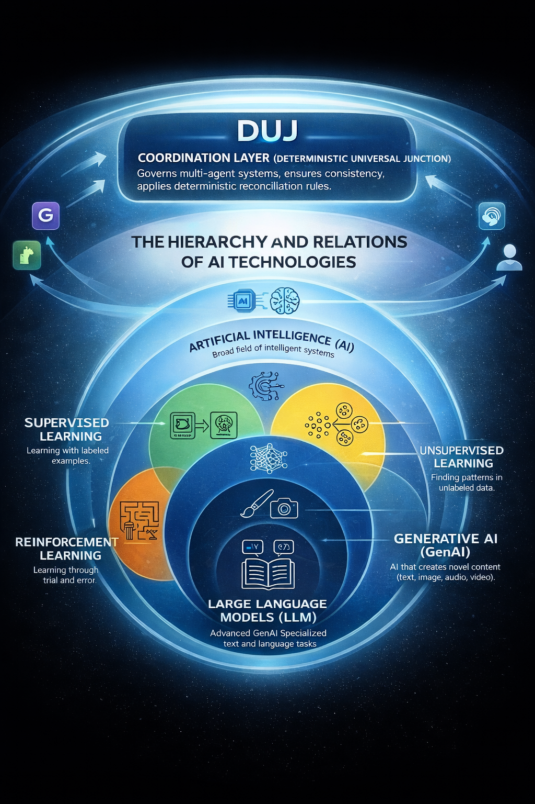

## 🧠 DUJ — Deterministic Universal Junction

*(Dynamique Unifiée des Jetons)*

A coordination kernel for multi-agent intelligence systems.
---

## 🖼 System Architecture

### 🔷 What is DUJ?

DUJ is a coordination layer that sits above AI systems and governs interactions between independent agents.

It enforces invariant-preserving system states through deterministic reconciliation.

# DUJ — Dynamiques Unifiées des Jetons
*(Unified Dynamics of Tokens)*

This project is stewarded by the DUJ-FEITH Foundation.

Foundation: https://dujfeithfoundation.org

## Table of Contents

- [Overview](#overview)
- [Scope](#scope)
- [Non-Goals](#non-goals)
- [Positioning](#positioning)
- [Early Formalizations](#early-formalizations)
- [Status](#status)
- [License](#license)

## Abstract
DUJ (Dynamiques Unifiées des Jetons) is a substrate-level framework for structural alignment and system viability.  
It treats alignment not as preference matching or post-hoc control, but as the preservation of invariants governing multi-agent coordination across time. Human agency is modeled as a structural viability condition: systems that marginalize it destabilize through invariant violation rather than policy choice.

## Scope
DUJ operates upstream of protocol, constitutional, or governance-layer approaches.

It provides:
- A unified view of token dynamics as carriers of structure, agency, and coordination  
- A substrate-level framing of alignment grounded in system viability  
- A basis for reasoning about multi-agent stability, identity persistence, and collapse modes across time  

## Non-goals
DUJ is **not**:
- A governance protocol or veto mechanism  
- A preference-alignment or values-learning framework  
- A post-training or fine-tuning method  
- A proposal limited to AI safety alone  

## Positioning
Protocol-level alignment mechanisms (constitutions, vetoes, reward shaping) are treated as downstream instantiations that may succeed or fail depending on whether underlying DUJ invariants are preserved.

## Status
This repository serves as the canonical public reference for DUJ (v0.1).  
Formalization, simulations, and applied instantiations will be released in subsequent work.

## Priority note
This repository establishes the public existence and conceptual scope of DUJ as of **2026-02-04**.
## Early Formalizations

- **ACTC v0.1** — A minimal toy formalism demonstrating that when system influence capacity exceeds human counter-control, collapse of human viability is inevitable regardless of downstream alignment mechanisms.  
  See [`ACTC_v0.1`](docs/toy-formalisms/ACTC_v0.1.md).
