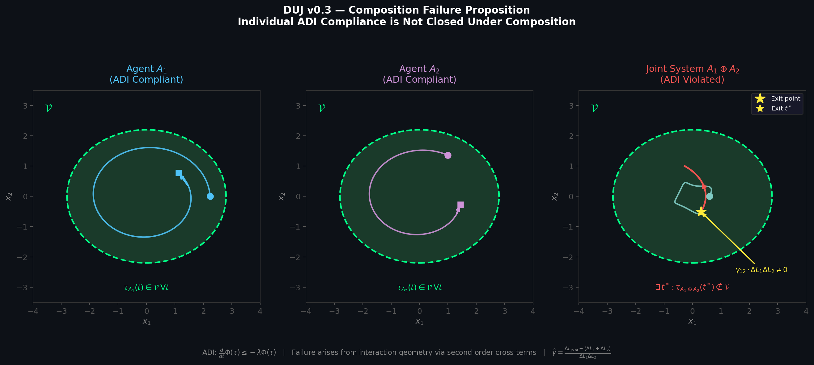

# Substrate-Level AI Safety v0.1

## Positioning
This note introduces substrate-level coordination invariants as a fourth layer of AI safety beneath runtime policy and training-time alignment.

## Core methodological inversion
GPU observables → measurable quantities → DUJ variables

## Primary estimators
- γ̂ interaction coefficient from latency contention
- D_lineage from register spill degradation
- τ̂_ij from latency-ratio dilation sweeps

## Formal Anchor Figure

Figure 1 visualizes the v0.3 composition failure proposition: two individually ADI-compliant agents remain viable in isolation, while the jointly coupled trajectory exits the viability set due to the interaction cross-term γ.

